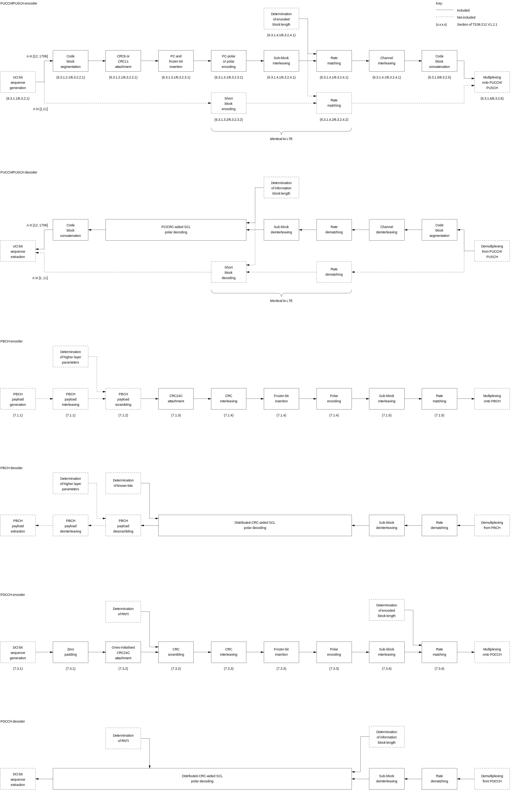
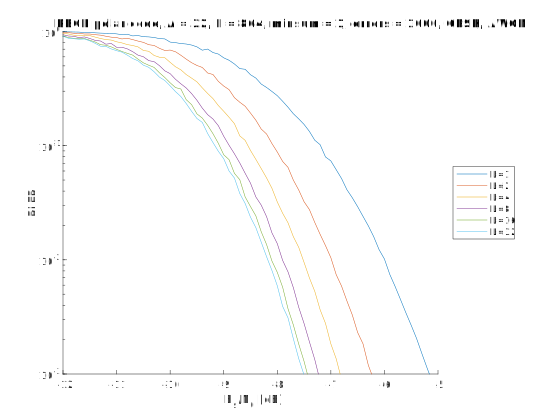
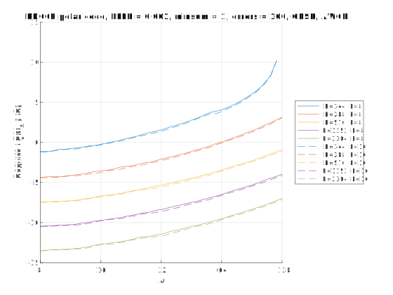
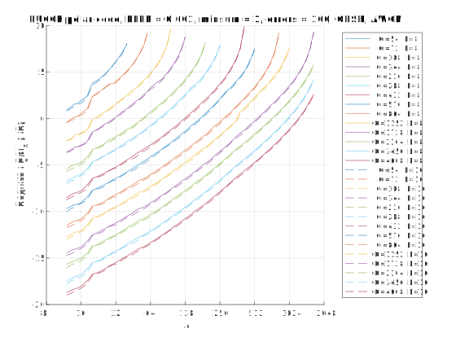

# polar-3gpp-matlab
Matlab simulations of the encoder and Successive Cancellation List (SCL) decoder for the New Radio polar code from 3GPP Release 15, as defined in [TS38.212 V15.2.0](http://www.3gpp.org/ftp//Specs/archive/38_series/38.212/38212-f20.zip) and used in the Public Broadcast Channel (PBCH), Physical Downlink Control Channel (PDCCH) and Physical Uplink Control Channel (PUCCH).

This code is intended to provide a reference model for the standard and has been written with a focus on correctness, rather than on simulation speed. This code is also intended to provide a platform for research on enhancements to the New Radio polar code. This motivates the inclusion of the custom1_encoder and custom1_decoder, alongside encoders and decoders for the New Radio PBCH, PDCCH and PUCCH channels. In particular, custom1_encoder and custom1_decoder adapt the New Radio polar code for general purpose applications, enabling support for arbitrarily-high information block lengths A. By contrast, the longest block lengths supported in the New Radio PBCH, PDCCH and PUCCH channels are 32, 140 and 1706 bits, respectively.

 Plot of Block Error Rate (BLER) versus channel Signal to Noise Ratio (SNR) Es/N0 for the Public Broadcast Channel (PBCH) polar code of 3GPP New Radio, when using Quadrature Phase Shift Keying (QPSK) for communication over an Additive White Gaussian Noise (AWGN) channel. Here, A is the number of bits in each information block, E is the number of bits in each encoded block and L is the list size used during min-sum Successive Cancellation List (SCL) decoding. The simulation of each SNR was continued until 1000 block errors were observed. Capacity plots are provided by the O(n−2) metaconverse PPV upper bound. |  Plot of Signal to Noise Ratio (SNR) Es/N0 required to achieve a Block Error Rate (BLER) of 10-3 versus number bits in each information block A for the Physical Downlink Control Channel (PDCCH) polar code of 3GPP New Radio, when using Quadrature Phase Shift Keying (QPSK) for communication over an Additive White Gaussian Noise (AWGN) channel. Here, E is the number of bits in each encoded block and L is the list size used during min-sum Successive Cancellation List (SCL) decoding. The simulation of each SNR was continued until 100 block errors were observed. Capacity plots are provided by the O(n−2) metaconverse PPV upper bound.
:---: | :---:
 **Plot of Signal to Noise Ratio (SNR) Es/N0 required to achieve a Block Error Rate (BLER) of 10-3 versus number bits in each information block A for the Physical Uplink Control Channel (PUCCH) polar code of 3GPP New Radio, when using Quadrature Phase Shift Keying (QPSK) for communication over an Additive White Gaussian Noise (AWGN) channel. Here, G is the number of bits in each encoded block and L is the list size used during min-sum Successive Cancellation List (SCL) decoding. The simulation of each SNR was continued until 100 block errors were observed. Capacity plots are provided by the O(n−2) metaconverse PPV upper bound.** |

The capacity plots in the Figures above were obtained using the O(n−2) metaconverse PPV upper bound from the [SPECTRE Short Packet Communication Toolbox](https://github.com/yp-mit/spectre). If you use these results, please acknowledge them with a reference to...

T. Erseghe, "Coding in the Finite-Blocklength Regime: Bounds Based on Laplace Integrals and Their Asymptotic Approximations", IEEE Transactions on Information Theory, vol. 62, no. 12, pp. 6854 - 6883, Dec. 2016.

Section of TS38.212 | Implemented in | Comment
--- | --- | ---
5.1 |  [components/get_crc_generator_matrix.m](https://github.com/robmaunder/polar-3gpp-matlab/blob/master/components/get_crc_generator_matrix.m) | The CRC bits are generated using b = [a, mod(a*G_P, 2)].
5.2.1 | [PUCCH_encoder.m](https://github.com/robmaunder/polar-3gpp-matlab/blob/master/PUCCH_encoder.m) | The first and second segments are obtained as a(1:floor(A/C)) and a(floor(A/C)+1:A), respectively.
5.3.1 | [components/get_3GPP_N.m](https://github.com/robmaunder/polar-3gpp-matlab/blob/master/components/get_3GPP_N.m) |
5.3.1.1 | [components/get_3GPP_crc_interleaver_pattern.m](https://github.com/robmaunder/polar-3gpp-matlab/blob/master/components/get_3GPP_crc_interleaver_pattern.m) | Interleaving is implemented using c_prime = c(Pi).
5.3.1.2 Q0N-1 | [components/get_3GPP_sequence_pattern.m](https://github.com/robmaunder/polar-3gpp-matlab/blob/master/components/get_3GPP_sequence_pattern.m) | The elements of Q0N-1 are incremented by 1, since indices begin at 1 in Matlab.
5.3.1.2 QPCN | [components/get_PC_bit_pattern.m](https://github.com/robmaunder/polar-3gpp-matlab/blob/master/components/get_PC_bit_pattern.m) | Provides a vector of N elements, in which the elements with the indices QPCN are set to true and all other elements are set to false.
5.3.1.2 u | [components/PCCA_polar_encoder.m](https://github.com/robmaunder/polar-3gpp-matlab/blob/master/components/PCCA_polar_encoder.m) | Other components/\*_polar_encoder.m files are also useful for special cases without PC bits, without CRC bits or with distributed CRC bits.
5.3.1.2 GN | [components/get_G_N.m](https://github.com/robmaunder/polar-3gpp-matlab/blob/master/components/get_G_N.m) | Encoding is implemented using d = mod(u\*G_N, 2).
5.4.1.1 P(i) | [components/get_3GPP_rate_matching_pattern.m](https://github.com/robmaunder/polar-3gpp-matlab/blob/master/components/get_3GPP_rate_matching_pattern.m) |
5.4.1.1 QIN | [components/get_3GPP_info_bit_pattern.m](https://github.com/robmaunder/polar-3gpp-matlab/blob/master/components/get_3GPP_info_bit_pattern.m) | Provides a vector of N elements, in which the elements with the indices QIN are set to true and all other elements are set to false.
5.4.1.2 | [components/get_3GPP_rate_matching_pattern.m](https://github.com/robmaunder/polar-3gpp-matlab/blob/master/components/get_3GPP_rate_matching_pattern.m) | Rate matching is implemented using e = d(rate_matching_pattern).
5.4.1.3 | [components/get_3GPP_channel_interleaver_pattern.m](https://github.com/robmaunder/polar-3gpp-matlab/blob/master/components/get_3GPP_channel_interleaver_pattern.m) | Interleaving is implemented using f = e(channel_interleaver_pattern).
5.5 | [PUCCH_encoder.m](https://github.com/robmaunder/polar-3gpp-matlab/blob/master/PUCCH_encoder.m) | The first and second segments are concatenated using f = [f, ...].
6.3.1.2.1 | [PUCCH_encoder.m](https://github.com/robmaunder/polar-3gpp-matlab/blob/master/PUCCH_encoder.m) |
6.3.1.3.1 | [PUCCH_encoder.m](https://github.com/robmaunder/polar-3gpp-matlab/blob/master/PUCCH_encoder.m) |
6.3.1.4.1 | [PUCCH_encoder.m](https://github.com/robmaunder/polar-3gpp-matlab/blob/master/PUCCH_encoder.m) | Rate matching is implemented, but not the determination of EUCI.
6.3.1.5 | [PUCCH_encoder.m](https://github.com/robmaunder/polar-3gpp-matlab/blob/master/PUCCH_encoder.m) |
6.3.2.2.1 | [PUCCH_encoder.m](https://github.com/robmaunder/polar-3gpp-matlab/blob/master/PUCCH_encoder.m) |
6.3.2.3.1 | [PUCCH_encoder.m](https://github.com/robmaunder/polar-3gpp-matlab/blob/master/PUCCH_encoder.m) |
6.3.2.4.1 | [PUCCH_encoder.m](https://github.com/robmaunder/polar-3gpp-matlab/blob/master/PUCCH_encoder.m) | Rate matching is implemented, but not the determination of EUCI.
6.3.2.5 | [PUCCH_encoder.m](https://github.com/robmaunder/polar-3gpp-matlab/blob/master/PUCCH_encoder.m) |
7.1.3 | [PBCH_encoder.m](https://github.com/robmaunder/polar-3gpp-matlab/blob/master/PBCH_encoder.m) |
7.1.4 | [PBCH_encoder.m](https://github.com/robmaunder/polar-3gpp-matlab/blob/master/PBCH_encoder.m) |
7.1.5 | [PBCH_encoder.m](https://github.com/robmaunder/polar-3gpp-matlab/blob/master/PBCH_encoder.m) |
7.3.1 | [PDCCH_encoder.m](https://github.com/robmaunder/polar-3gpp-matlab/blob/master/PDCCH_encoder.m) | Only implements the zero padding of DCI formats, to increase their length to 12 bits.
7.3.2 | [PDCCH_encoder.m](https://github.com/robmaunder/polar-3gpp-matlab/blob/master/PDCCH_encoder.m) |
7.3.3 | [PDCCH_encoder.m](https://github.com/robmaunder/polar-3gpp-matlab/blob/master/PDCCH_encoder.m) |
7.3.4 | [PDCCH_encoder.m](https://github.com/robmaunder/polar-3gpp-matlab/blob/master/PDCCH_encoder.m) |

Each of the \*_encoder.m files has corresponding \*_decoder.m files, for performing the corresponding operation of the receiver.

Many thanks to my colleagues at [AccelerComm](http://www.accelercomm.com), who have spent lots of time double checking that this code matches the standard.

Have fun! Rob.

